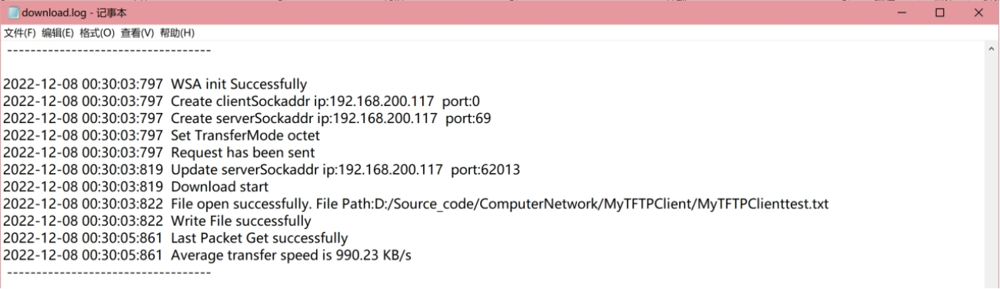
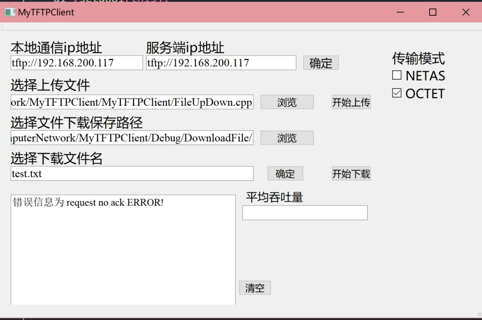

# MyTFTPClient

**一个 TFTP 客户端程序。**

**目标是在 UDP 之上上建立一个类似于 FTP 的但仅支持文件上传和下载功能的传输协议**

该客户端在操作合法且网络条件良好的情况下，可在两种不同传输模式下，严格按照TFTP协议与标准TFTP服务器通信，实现对不同后缀格式的文件以及不同大小的文件的传输，且传输速率达到了很好的预期；对于用户的操作，该界面可以及时与用户交互，显示操作是否合法、文件传输成功的结果、文件传输失败的原因，并在右下角显示文件上传与下载的吞吐量。同时，该程序在能够记录日志，显示系统时间、用户操作、传输成功、传输失败、超时重传等行为。

## 1 系统开发环境

处理器：AMD Ryzen 7 5800H with Radeon Graphics 3.20 GHz

系统类型：64 位操作系统, 基于 x64 的处理器

版本：Windows 10 家庭中文版 

版本号：21H2 

操作系统内部版本：19044.2006

IDE：Microsoft Visual Studio Community 2022 (64 位) - 17.3.4

编译器：5.14.2_msvc2017

拓展：Qt Visual Studio Tools - 2.9.1.6

配置类型：应用程序(.exe) 

项目配置平台：Win32

Windows SDK 版本：10.0 

平台工具集：Visual Studio 2022 (v143) 

语言标准：默认(ISO C++14 标准)

Tftp服务器：tftp64.exe

链路丢包模拟软件：clumsy.exe

## 2 运行说明

1. 打开Tftp服务器。
2. 按照界面提示设置本地IP，服务器IP。
3. 选择需要上传/下载的文件，进行文件传输，传输结果会在界面显示。
4. 日志会记录在路径 ”MyTFTPClient\MyTFTPClient\log“ 下。

## 3 测试

1. 测试正常传输，即无丢包无延迟等特殊情况。

对于上传功能，用户先设定客户端本地通信IP与服务端的IP地址（可以只输入ip，系统会自动加上tftp协议的前缀，若输入IP不合法会及时在框中显示），在右侧选择传输模式，点击确定后选择上传的文件，点击“开始上传”即可。

大文件test.txt上传的界面测试结果如图3-1所示，选择OCTET模式进行测试，若上传成功，左下侧输出框中会显示上传成功的提示信息，右侧显示平均吞吐量。同时，该上传操作会进行upload.log的文件中进行日志记录，显示了时间、传输模式、端口号等详细信息，如图3-2所示。

 

图3-1 上传test.txt界面

 

 

图3-2 上传test.txt日志

 

不同格式的文件vc140.pdb测试结果如图3-3所示，在服务器端的日志里也可以看到上传成功的信息。

 

图3-3 上传vc140.pdb界面

 

对于下载功能，用户先设定客户端本地通信IP与服务端的IP地址（可以只输入ip，系统会自动加上tftp协议的前缀，若输入IP不合法会及时在框中显示），在右侧选择传输模式，选择文件想要保存的路径，输入需要从服务器端下载的文件名，若不存在会进行错误操作提示。最后点击“开始下载”即可。

对于大文件下载的测试结果如图3-4所示，若下载成功，左下侧输出框中会显示传输成功的提示信息，右侧显示平均吞吐量。同时，该上传操作会进行download.log的文件中进行日志记录，显示了时间、传输模式、端口号等详细信息，如图3-5所示。

 

 

图3-4 下载test.txt界面

 

 

图3-5 下载test.txt日志

 

不同格式的文件vc140.pdb测试结果如图3-6所示，选择NETAS模式进行测试，在服务器端的日志里也可以看到上传成功的信息。

 

 

图3-6 下载vc140.pdb日志

 

综上测试结果，当客户端一切操作合法，可以成功传输时，该客户端可在两种不同传输模式下，严格按照TFTP协议与标准TFTP服务器通信，实现对不同后缀格式的文件以及不同大小的文件的传输，即正常上传文件，并下载服务器中的指定文件，且传输速率高，达到了很好的效果。同时，该界面可以及时与用户交互，显示操作是否合法的信息，文件操作成功与否的结果，并在右下角显示文件上传与下载的吞吐量，前后端衔接紧密，更方便用户操作。在传输成功同时也可以记录日志，显示了详细的操作与传输信息。

 

2. 测试失败传输，包含一些不合法操作。

输入错误的IP地址，界面会显示“bind ERROR”，即提示用户IP地址与套接字绑定错误，如图3-7所示。

 

 

图3-7 错误IP地址界面

 

关闭服务器，客户端无法与服务器取得连接，即客户端发送WRQ/RRQ而服务器没有ACK应答包，会在界面上显示响应的错误信息“request no ack ERROR!”，如图3-8所示。同时，在日志中会记录详细信息，如图3-9所示，显示了在未取得服务器响应时，客户端发送了五条重复请求，最终未取得响应，传输任务结束。

 

图3-8 服务器无响应时界面

 

 

图3-9 服务器无响应日志

 

下载文件时，输入不存在的文件名，会在界面上显示“File not found”的错误信息，如图3-10所示。同时，在日志中会记录详细信息，如图3-11所示，显示了详细的错误信息，即没有找到目标文件，传输任务结束。

 

图3-10 下载的目标文件不存在界面

 

 

图3-11 下载的目标文件不存在日志

 

综上测试结果，针对传输失败的文件，能够在界面上显示操作失败的信息以及不合法的原因。同时，该程序可以针对用户操作，传输失败，超时重传等行为记录日志。

 

\3. 测试可靠传输，模拟极端网络条件。

开启链路丢包模拟软件clumsy.exe进行特殊情况的模拟，如图3-12所示，开启延时为50ms同时丢包10%，依旧可以成功上传文件，只是传输速率大大缩减。同时，为了更好的用户交互性，当传输速率较慢时，在界面的输出框中会显示开始上传等信息，显示目前正在进行的操作。同时，如图3-13所示，在日志中会显示“Request has been sent again”的重传信息。

 

图3-12 测试可靠传输时的服务器、模拟软件、客户端显示

 

图3-13 测试可靠传输时的日志显示

 

由此结果可以得出，在利用clumsy.exe模拟网络情况不好的条件下，该客户端依旧可以实现文件传输功能，并正确显示操作信息，达到了可靠传输的目的。

综上结果，可以看出，该客户端在操作合法且网络条件良好的情况下，可在两种不同传输模式下，严格按照TFTP协议与标准TFTP服务器通信，实现对不同后缀格式的文件以及不同大小的文件的传输，且传输速率达到了很好的预期；对于用户的操作，该界面可以及时与用户交互，显示操作是否合法、文件传输成功的结果、文件传输失败的原因，并在右下角显示文件上传与下载的吞吐量。同时，该程序在能够记录日志，显示系统时间、用户操作、传输成功、传输失败、超时重传等行为。
